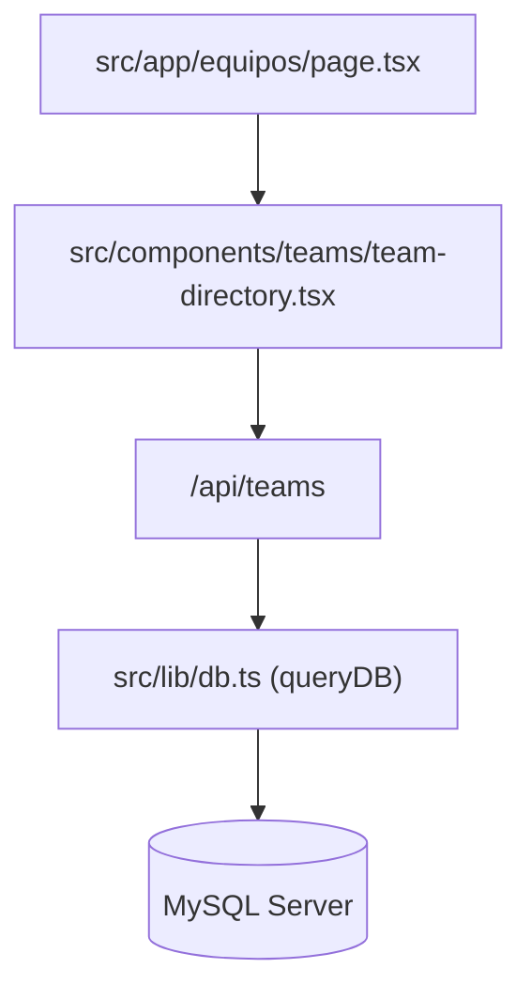

# 🕸️ Graphify Codebase Knowledge Mapping

This skill provides methodologies for visual and structural mapping of codebases inspired by `Graphify-Labs/graphify`.

## 🛠️ Core Principles

1. **Dependency & Flow Mapping**:
   - Visualize component hierarchies, module dependencies, and API request/response pipelines using standard Mermaid diagrams.

2. **Schema & Model Graphing**:
   - Map entity-relationship diagrams (ERDs) for database tables, TypeScript interfaces, and state stores.

3. **Structural Analysis**:
   - Map imports, exports, and circular dependency risks before refactoring large components.

### Example Mermaid Component Dependency Flow:

