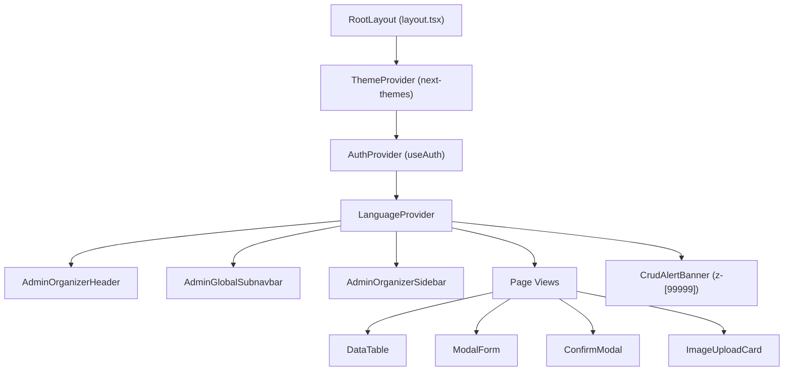
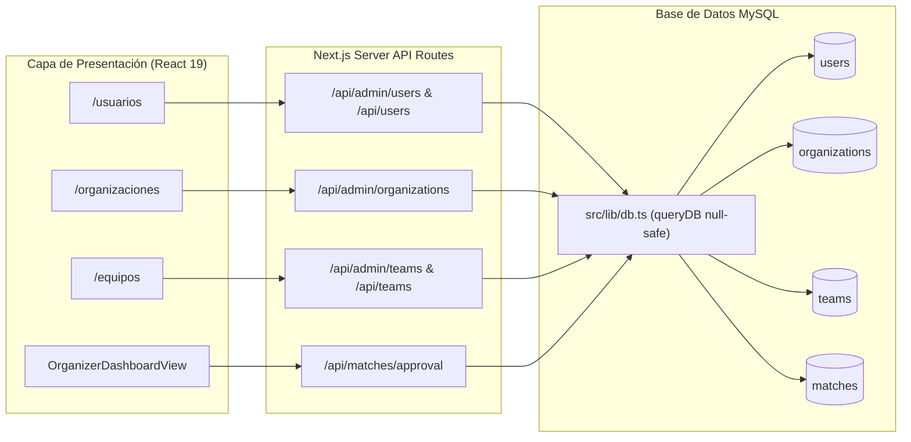

# 🕸️ GRAPHIFY — Mapa Estructural y Grafo de Navegación de TournamentsPro

Este documento fue generado aplicando la skill **Graphify** para mapear la arquitectura completa del proyecto, jerarquía de componentes, flujos de navegación y relaciones de datos en MySQL.

---

## 1. 🗺️ Grafo de Enrutamiento y Navegación (Next.js App Router)

```mermaid
graph TD
    Root["/ (Landing Page eSports)"] --> Login["/login"]
    Root --> Registro["/registro"]
    Root --> Usuarios["/usuarios (Directorio & Gestión Atletas)"]
    Root --> Organizaciones["/organizaciones (Sedes Madre)"]
    Root --> Equipos["/equipos (Directorio Global Escuadras)"]
    Root --> Dashboard["/dashboard (Panel Admin / Organizador)"]
    Root --> Matchday["/club/matchday (Reporte & Visto Bueno)"]
    Root --> PortalJuego["/[gameSlug] (Portal Dedicado eSports)"]

    PortalJuego --> SectionHome["/[gameSlug]/home"]
    PortalJuego --> SectionEquipos["/[gameSlug]/equipos"]
    PortalJuego --> SectionJugadores["/[gameSlug]/jugadores"]
    PortalJuego --> SectionMatches["/[gameSlug]/partidos"]
    PortalJuego --> SectionAjustes["/[gameSlug]/atleta/ajustes"]

    click Root "file:///c:/xampp/htdocs/TournamentsPro/src/app/page.tsx"
    click Usuarios "file:///c:/xampp/htdocs/TournamentsPro/src/app/usuarios/page.tsx"
    click Organizaciones "file:///c:/xampp/htdocs/TournamentsPro/src/app/organizaciones/page.tsx"
    click Equipos "file:///c:/xampp/htdocs/TournamentsPro/src/app/equipos/page.tsx"
    click Dashboard "file:///c:/xampp/htdocs/TournamentsPro/src/app/dashboard/page.tsx"
    click Matchday "file:///c:/xampp/htdocs/TournamentsPro/src/app/club/matchday/page.tsx"
```

---

## 2. 🧱 Grafo de Jerarquía de Layout y Componentes UI

---

## 3. 🔄 Grafo de Flujo de Datos y Conexión MySQL API

---

## 📂 4. Mapa de Archivos por Módulo

- **Núcleo de Base de Datos**: `src/lib/db.ts` • `src/lib/api-types.ts` • `src/lib/auth.ts`
- **Catálogo eSports & Modalidades**: `src/lib/games-data.ts` (`GAME_MODES`, `GAMES_CATALOG`)
- **Gestión de Atletas**: `src/app/usuarios/page.tsx` • `src/app/api/admin/users/route.ts` • `src/app/api/users/route.ts`
- **Gestión de Organizaciones**: `src/app/organizaciones/page.tsx` • `src/app/api/admin/organizations/route.ts`
- **Gestión de Clubes**: `src/app/equipos/page.tsx` • `src/components/teams/team-directory.tsx` • `src/app/api/admin/teams/route.ts` • `src/app/api/teams/route.ts`
- **Panel Organizador**: `src/components/organizer/organizer-dashboard-view.tsx` • `src/components/layout/admin-organizer-sidebar.tsx`
